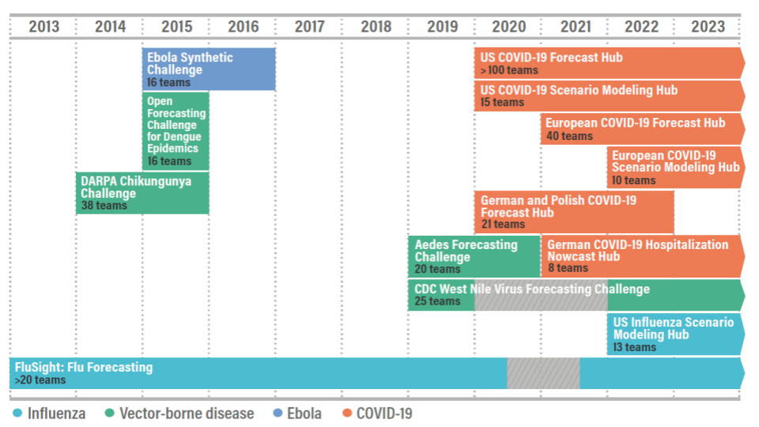
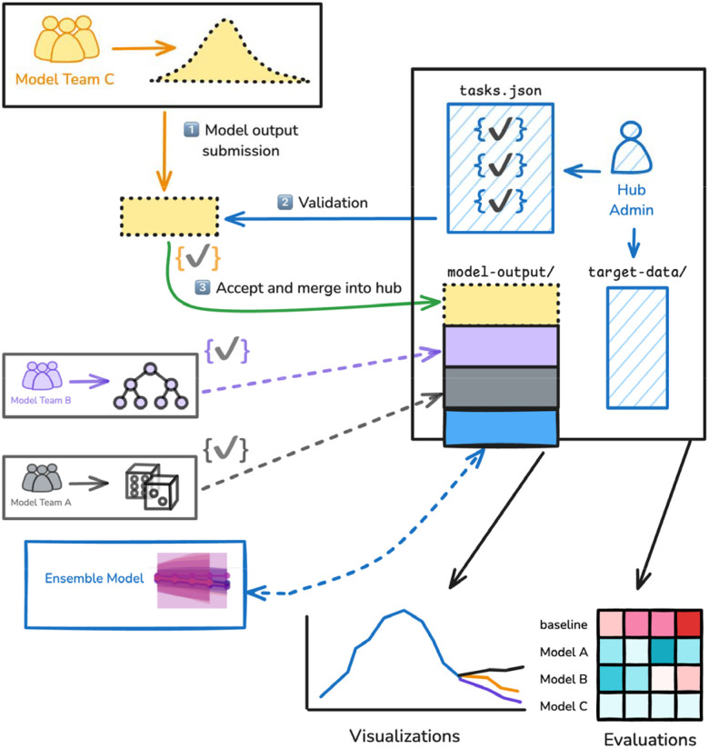
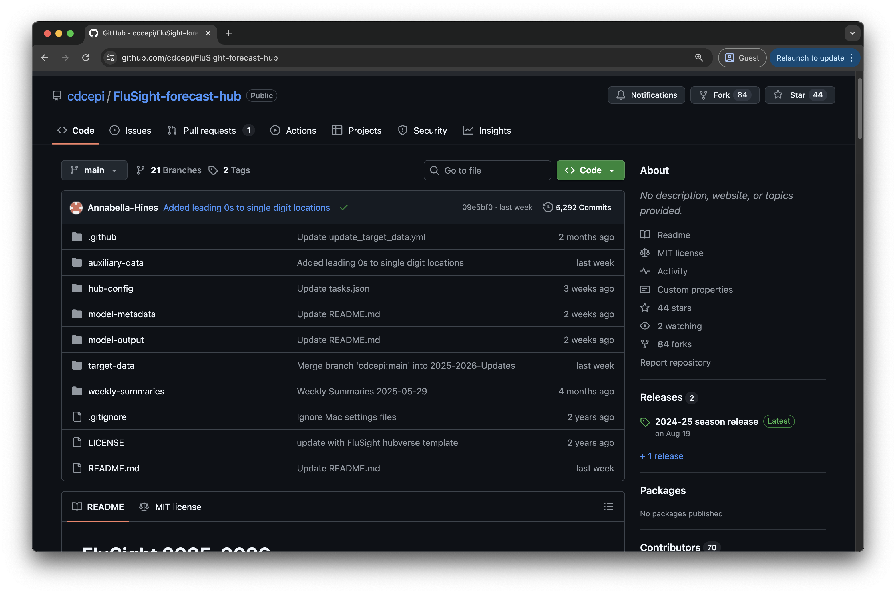
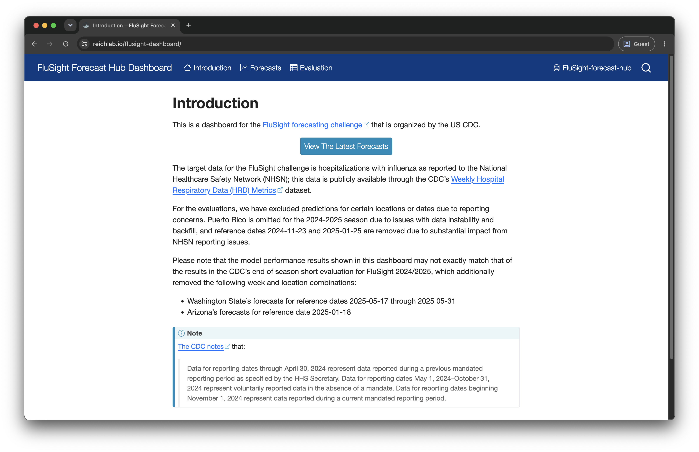
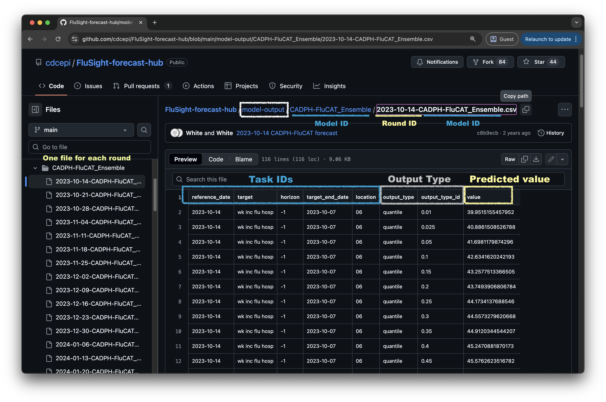
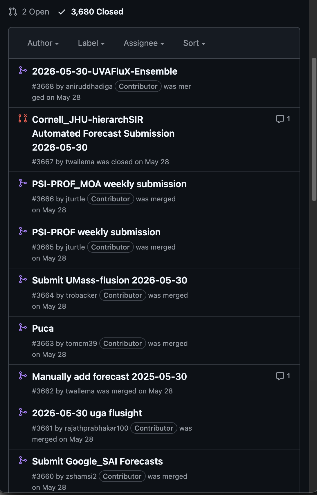
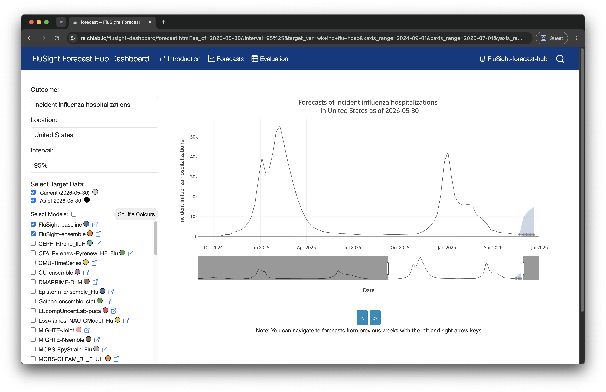
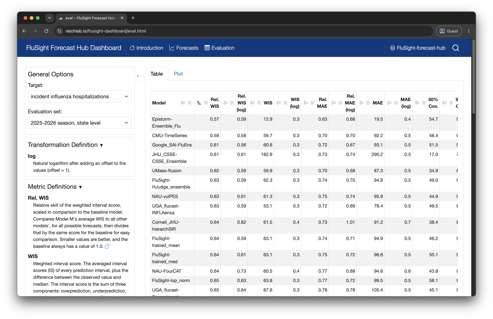
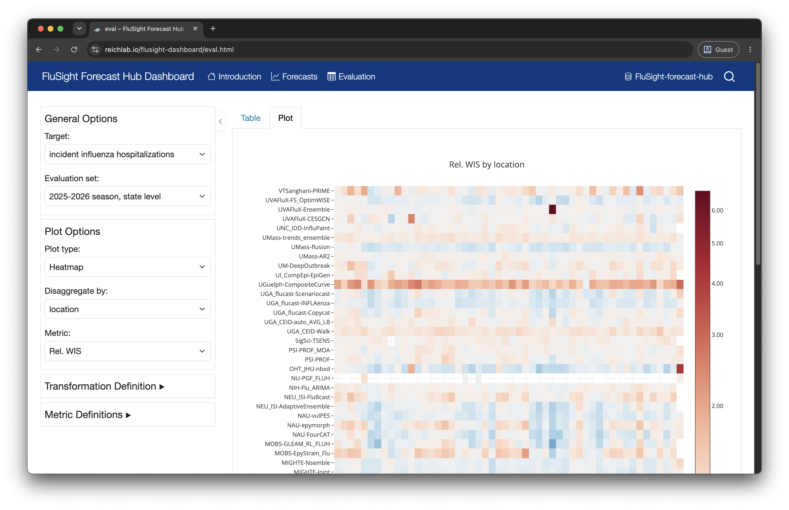

# Background {.inverse}

::: notes
Hi everyone,

My name is Anna Krystalli.

I used to be an **RSE at the University of Sheffield**, so it's lovely to be back, but a few years ago I returned home to Greece and **set up my own RSE company**.

Today I'm going to talk to you about the **hubverse**, a project I've been involved in since 2023.

And I'll start with some **motivating background on the project**.
:::

## ❌ Where we started

**Infectious disease modeling scaled rapidly through COVID-19…**

-   …but by 2020 the landscape had become **fragmented**:
    -   Inconsistent formats
    -   Redundant or conflicting forecasts
    -   Little coordination between modelers and stakeholders

> “Comparing the accuracy of forecasting applications is difficult because forecasting methods, forecast outcomes, and reported validation metrics varied widely.”
>
> -   [Chretien et al., PLOS ONE, 2014](https://journals.plos.org/plosone/article?id=10.1371/journal.pone.0094130)

::: {.callout-note appearance="minimal" icon="false"}
Much **less true today**, which is rather the point of the rest of this talk.
:::

::: notes
Over the past two decades, and especially through the COVID-19 pandemic, **infectious disease modeling became a central tool in public health decision-making**.

With this, we've seen an **explosion of forecasting efforts**.

The growth has been **encouraging**: it reflects **increased computational capacity**, **improved data availability**, and **global interest** in predictive analytics for public health.

But it initially also came with some growing pains.

-   **Modeling efforts developed independently**: each group used its **own data structure** for model outputs, **metadata** and **evaluation**, making **integration and comparison difficult**.

-   **Modelers and decision-makers didn't always communicate clearly**, so model outputs **didn't always match what public health actually needed**.

    This initially **limited the collective utility** of all that work.

:::

------------------------------------------------------------------------

## ✨ The promise of modeling hubs

**Modeling hubs** coordinate collaborative forecasting:

-   Provide **centralised location** for effort coordination

-   Define **data** **standards** and **modeling** **targets**

-   Improve **transparency** and **comparability**

-   Aggregate forecasts **enabling ensembles**

-   Facilitate timely **public health decision-making**

    \

> [***“Collaborative Hubs: Making the Most of Predictive Epidemic Modeling”***](https://ajph.aphapublications.org/doi/full/10.2105/AJPH.2022.306831)***,** American Journal of Public Health Reich, et al. 2022*

::: notes
**Modeling hubs**, which provide **centralized infrastructure** for **coordinating the modeling efforts** of multiple groups, have helped tackle such limitations.

-   Firstly Hubs **bring structure** and a standardised central location for collecting model outputs.

-   They **establish a shared modeling protocol**: what outcomes to forecast, in what format etc.

-   By enforcing **standards** and **submission rules**, hubs ensure that **forecasts can be compared.**

-   Standardization also **allows for ensemble models that combine many forecasts**, often outperforming individual models.

-   Hubs make it easier for stakeholders, from **local agencies** to **national institutions**, to **access timely, interpretable forecasts**.

:::

------------------------------------------------------------------------

## 🕰️ Project origins

-   **Pre-COVID:** Forecasting code base existed for CDC **influenza** hubs
-   **During COVID:** That code was reused for new **COVID-19** hubs + demand internationally (e.g. Europe) for similar setups
-   ❗ Problem: Each hub required **manual editing** of source code

**➡️ Need for generalisation, modularity, and configurability**

{fig-alt="Timeline of forecasting hub development" fig-align="left" width="620"}

::: notes
Before COVID, the US CDC had **already established a foundation for collaborative infectious disease forecasting** through its **FluSight initiative**, focused on influenza.

This resulted in an **initial working codebase to support such efforts**.

During the pandemic, **interest in modeling hubs exploded** with many groups wanting to repurpose this infrastructure:

• First the **US CDC COVID-19 Forecast Hub**

• Then interest grew to **scenario modeling hubs**, as well as **internationally**.

**‼ BUT** to set up each new hub, **manual changes to the source code was required**, obviously not ideal.

This is what **motivated the development** of a more **configurable**, **generalized** and  **modular** system to support **new infectious disease modeling hubs.**
:::

------------------------------------------------------------------------

## 🌐 Enter the **hubverse**

An open-source **software ecosystem** to power modeling hubs:

-   GitHub repositories for **centralising hub activity**
-   **Data standards** for infectious disease modeling data
-   **Schema-driven configuration** for modeling tasks + hub setup
-   Modular tools for validation, access, evaluation, ensembling, communication and hub administration
-   **Supports full lifecycle:** from hub set up, data submission to decision-making

::: {.callout-note appearance="minimal" icon="false"}
📄 Consortium of Infectious Disease Modeling Hubs *et al.* (2026) **A software platform for collaborative infectious disease modelling**, *Nature Health*. <https://doi.org/10.1038/s44360-026-00145-7>
:::

::: notes
... and this is really **how the hubverse began**,

which is an **open-source software ecosystem** designed **to support the full lifecycle of infectious disease modeling hubs**.

It brings together:

-   Centralised version controlled location for hub activities through GitHub repositories

• **Standardised data formats** for infectious disease modeling.

• **Schema-driven configuration**, for defining a hub's modeling tasks, submission schedule, and other expectations.

• A **suite of tools** for hub **administration**, **data validation**, **access**, **evaluation**, **ensembling, visualisation** and **communication**.

:::

# Anatomy of a hub

::: notes
So let's start by looking at **what a hub actually is**, before we get into how you configure and operate one.
:::

------------------------------------------------------------------------

## 🏗️ What a hub actually is

:::::: columns
::: {.column width="62%"}
{width="80%" fig-alt="Diagram of hub architecture: model teams submit model output, which is validated against tasks.json and merged into the model-output directory alongside target data, then flows into ensembles, visualizations and evaluations."}
:::

::: {.column width="38%"}
1.  Modeling teams **submit model output**
2.  Submissions **validated** against `tasks.json`
3.  Accepted output **merged into the hub**

Everything downstream, **ensembles**, **visualisations**, **evaluations**, comes for free once the data are standardised.

::: {.callout-note appearance="minimal" icon="false"}
Figure 1 from the [hubverse paper](https://doi.org/10.1038/s44360-026-00145-7) ([preprint](https://doi.org/10.1101/2025.10.03.25337284), CC BY 4.0)
:::
:::
::::::

::: notes

Here's a general overview of a hub which usually lives in a github repository

It starts with the **hub administrator**. They **configure the hub** which sets out exactly what predictions the hub wants to collect.

They also **maintain `target-data`**: what **actually happened**, which is what predictions are scored against.

With that in place, different **modeling teams** submit model outputs of any type of model they want really as long as it matches hub expectations and requirements.

To confirm this, each submission is then **validated against the configuration**. If it passes, it's **merged**.

... and downstream activities like building **ensembles**, **visualising**, and **evaluating** model outputs follow.

:::

------------------------------------------------------------------------

## ☑️ A shared data standard

::::: columns
::: {.column width="52%"}
Modeling hubs are **built around a shared data standard:**

-   **Modeling task definition**: what's predicted, by when, for where, in what form
-   **Structured hub layout**: consistent file system for organizing submissions
-   **Standard model output format**: for file content and naming

✅ Enables comparability, validation, and streamlined data access
:::

::: {.column width="48%"}
``` bash
FluSight-forecast-hub/
├── hub-config/
│   ├── admin.json
│   ├── tasks.json
│   ├── model-metadata-schema.json
│   └── target-data.json
├── model-output/
│   └── <model_id>/
│       └── <round_id>-<model_id>.csv
├── model-metadata/
│   └── <model_id>.yml
└── target-data/
```
:::
:::::

::: notes
And all this is **primarily enabled by the core of the hubverse** which is a **shared data standard**. Everything else **builds on that foundation.**

The standard covers three things.

**One:** how a **modeling task** is defined, what's being predicted, which predictors are used, what output types are accepted.

**Two:** the **hub layout** itself, which you can see on the right. `hub-config` for config files, `model-output` for submissions, one directory per model, `model-metadata` for metadata files describing each model, and `target-data` for storing observed data.

**Three:** the **model output files themselves** follow a **consistent format** and **naming** convention.

Together, these make model outputs **directly comparable** and **easy to combine downstream**.

:::

# 🦠 Meet the hub: CDC FluSight

::: notes
Before I go any further, let me introduce **a real hub** so we can  on **everything I show you comes from it**.

:::

------------------------------------------------------------------------

## The hub we'll follow: [CDC FluSight](https://github.com/cdcepi/FluSight-forecast-hub)

 [**https://github.com/cdcepi/FluSight-forecast-hub**](https://github.com/cdcepi/FluSight-forecast-hub){.uri}

::::: columns
::: {.column width="70%"}
{fig-alt="Screenshot of CDC Flusight Hub Github repo" width="92%"}
:::

::: {.column .smaller width="30%"}
-   Used by US CDC to **monitor influenza severity**
-   In season, **~60 models** from **~30 teams**, every single week
-   **95 models** from **47 teams** across **88 rounds** since 2023
-   Hosted on **GitHub + S3 cloud mirror**
-   Managed with the **full hubverse stack since 2023/24**

{fig-alt="US CDC logo" width="110"}
:::
:::::

::: notes
The **CDC FluSight Hub** is a flagship example of the hubverse stack in action.

It's used by the **US CDC to monitor influenza severity** through **weekly model outputs**. In the middle of a season that's around **60 models** arriving from about **30 teams**, **every week**. Cumulatively, **95 models** from **47 teams** have submitted across **88 rounds** since 2023.

The hub is **fully managed** using the hubverse software, **workflows** and **S3 cloud mirroring** since the **2023/24 season**.
:::

# Configuring FluSight

::: notes
Let's start by taking a look at the **FluSight's config files** to see **how a hub is actually configured**
:::

------------------------------------------------------------------------

## ⚙️ Config-driven hub setup

**Hub administrators configure hubs with structured JSON config files:**

-   `admin.json`: hub-level metadata and infrastructure
-   `tasks.json`: the **scientific question**: what to predict, when, and how
-   `model-metadata-schema.json`: what modelers must tell you about their model
-   `target-data.json`: where the observed data live

::: {.callout-tip appearance="minimal"}
All validated against a **versioned JSON [schema](https://github.com/hubverse-org/schemas)**. The config *is* the contract between administrators, modelers and tooling.
:::

::: {.callout-note appearance="minimal" icon="false"}
📦 [`hubAdmin`](https://hubverse-org.github.io/hubAdmin/) **validates and can create** these files programmatically.
:::

::: notes
Hub setup is configuration-based. No forking, no editing source code.

Administrators configure the hub through structured JSON files in `hub-config`. `admin.json` for hub-level properties. `tasks.json` for the modeling tasks ie the scientific question. `model-metadata-schema.json` for model level metadata and `target-data.json` which defines expectations for the observed data.

Config files themselves are validated against a versioned JSON schema that we maintain.

**The config is the contract.** It's how the admin communicates with the teams, what the validation enforces, and what every downstream tool uses to understand the hub.


:::

------------------------------------------------------------------------

## 🗂️ `admin.json`: the hub's identity card

``` {.json code-line-numbers="|2|3-8|9-13|14-21"}
{
  "schema_version": ".../schemas/main/v6.0.0/admin-schema.json",
  "name": "US CDC FluSight",
  "maintainer": "US CDC",
  "contact": {
    "name": "Rebecca Borchering",
    "email": "xhq2@cdc.gov"
  },
  "repository": {
    "host": "github",
    "owner": "cdcepi",
    "name": "FluSight-forecast-hub"
  },
  "file_format": ["csv", "parquet"],
  "timezone": "US/Eastern",
  "cloud": {
    "enabled": true,
    "host": {
      "name": "aws",
      "storage_service": "s3",
      "storage_location": "cdcepi-flusight-forecast-hub"
    }
  }
}
```

::: notes
This is the `admin.json` from the CDC FluSight hub. 

*(step through the highlights)*

First, `schema_version`. Pins the config to a specific schema version, v6 here. 

Then typical administrative metadata like Hub name, maintainer, etc.

Then where the hub lives.

followed by operational settings like what `file_format`s are allowed and the `timezone` submission deadlines are gated relative to.

Finally `cloud` allows admins to define whether and where a cloud mirror of hub data exists. More on that shortly. 

:::

------------------------------------------------------------------------

## 🎯 Inside `tasks.json`

``` {.bash code-line-numbers="|3-4|5|6|7-9"}
tasks.json
└── rounds[]                                   # a submission cycle
    ├── round_id_from_variable: true           # round IDs live in the data...
    ├── round_id: "reference_date"             # ...in this task ID
    ├── submissions_due                        # window, relative to the round
    └── model_tasks[]                          # groups of related predictions
        ├── task_ids{}                         # the DIMENSIONS of a prediction
        ├── output_type{}                      # the FORM the prediction takes
        └── target_metadata[]                  # what the target means
```

::: {.callout-note appearance="minimal" icon="false"}
A hub can have **many rounds**, each with **many model tasks**, so a single hub can ask for **several different kinds of prediction** at once.
:::

::: notes
`tasks.json` is the more complex but also more consequential config, so let's take a closer look.

At the top level we have rounds. A round is one submission cycle. For FluSight that's a week.

Each round has a `round_id`. This can work two ways.
1. It can be a literal string if a hub uses separate config blocks for each round. 
2. But if the rounds are driven by a variable in the data, admins supply the **name of a task ID**, that task ID's values become the round IDs but all other configuration is shared between rounds. That's what `round_id_from_variable: true` is flagging.

`submissions_due` sets the submission window.

Then model tasks. This is where a hub defines what it actually wants predicted. Each task is written as three blocks.

`task_ids` effectively define the predictor variables.

`output_type` is the form it takes. A quantile, a probability, a sample.

And `target_metadata` holds additional information about modeling targets.

Because a round can hold several model tasks, one hub can ask for quite different predictions at the same time. FluSight asks for both a count of hospitalisations and a categorical rate-change outlook, in the same round.
:::

------------------------------------------------------------------------

## 🏷️ Task IDs: the dimensions of a prediction

``` {.json code-line-numbers="|18-21"}
"task_ids": {
  "reference_date": {
    "required": null,
    "optional": ["2023-10-07", "2023-10-14", "..."]
  },
  "target": {
    "required": null,
    "optional": ["wk inc flu hosp"]
  },
  "horizon": {
    "required": null,
    "optional": [-1, 0, 1, 2, 3]
  },
  "location": {
    "required": null,
    "optional": ["US", "01", "02", "..."]
  },
  "target_end_date": {
    "required": null,
    "optional": ["2023-09-23", "2023-09-30", "..."]
  }
}
```

::: {.callout-tip appearance="minimal"}
`reference_date` + `horizon` × 1 week = `target_end_date`
:::

::: notes
Here's the task ID block from FluSight, abridged.

Every task ID gets two lists. `required` and `optional`. Required means you must submit a prediction for every one of those values. Optional means you may, but you don't have to. For FluSight, every combination is optional.

These are all standard forecasting task IDs, so they're covered by the hubverse schema and validated strongly out of the box. Hubs aren't restricted to them, though. You can define whatever task ID your modelling needs, you'll just have to add custom validation for it.

And `target_end_date` is a derived task ID. Its values have a one to one relationship with other task IDs: here the reference date, which is also the round ID, plus the horizon gives you the target end date.
:::

------------------------------------------------------------------------

## 🎯 Targets carry more than a name

::::: columns
::: {.column width="52%"}
`target` is a special task ID: every value in the column gets its own metadata entry

``` {.json code-line-numbers="|3-6|7|8-9|10"}
"target_metadata": [{
  "target_id": "wk inc flu hosp",
  "target_name": "incident influenza
     hospitalizations",
  "description": "Count of new hospital
     admissions in the week ending...",
  "target_units": "count",
  "is_step_ahead": true,
  "time_unit": "week",
  "target_type": "continuous"
}]
```
:::

::: {.column width="48%"}
**Descriptive**

-   `target_name`, `description`: for humans, and for axis labels

**Quantitative**

-   `target_units`: what is being counted
-   `is_step_ahead`, `time_unit`: one step in a sequence
-   `target_type`: its statistical type (`continuous`, `ordinal`, `date`, …)

::: {.callout-tip appearance="minimal"}
`target_type` constrains **how a prediction of this target can be expressed**. Which is exactly what an **output type** is…
:::
:::
:::::

::: notes
`target` is a special task ID, so every value in the target column gets its own entry in `target_metadata`.

Some of that is descriptive. A human readable name, a fuller description. Useful for people, and for labelling an axis on a dashboard.

But it also carries quantitative properties. The units. Whether it's a step ahead forecast, and in what time unit. And the target's statistical type.

Target type provides additional statistical properties of the target being predicted and is intimately linked to the last important tasks config block. And that is the output type.

So let's look at those.
:::

------------------------------------------------------------------------

## 📐 Output types: how a prediction is expressed {.smaller}



| `output_type` | `output_type_id` | `value` |
|-------------------|-----------------------|------------------------------|
| `mean` | *(none)* | mean of the predictive distribution |
| `median` | *(none)* | median of the predictive distribution |
| `quantile` | a probability level, e.g. `0.75` | the value at that quantile |
| `cdf` | a possible value, e.g. `500` | P(outcome ≤ 500) |
| `pmf` | a possible category, e.g. `"increase"` | P(outcome = `"increase"`) |
| `sample` | a sample index, e.g. `"s3"` | one draw from the distribution |

: {.hv-compact}

::: notes
The hubverse currently supports six output types, and these four panels cover all of them.

We accept the standard point estimates, `mean` and `median`. One number per prediction.

The most common output type hubs request, though, is `quantile`. The hub defines the probability levels it wants, and teams submit the predicted value at each one. 

`cdf` is the reverse. For each value the hub defines, teams submit the probability of landing at or below it. Useful when the question is about a threshold.

`pmf` is for categorical targets. A probability on each category, summing to one.

`sample` is a collection of draws from the predictive distribution.

Hubs can also ask for samples drawn from a **joint distribution**, which means values for multiple modeling tasks drawn at once, as a coherent set. Trajectories are the common example: a single draw across all horizons at once. That's what the panel shows, with each coloured line being one sample.

The table below has all six, with what `output_type_id` means for each. That shifting meaning is what lets very different predictions live in one format.
:::

------------------------------------------------------------------------

## 🎛️ …and how a hub configures them

``` {.json code-line-numbers="|3-5|6|7|10-14"}
"output_type": {
  "quantile": {
    "output_type_id": {
      "required": [0.01, 0.025, "...", 0.975, 0.99]
    },
    "is_required": true,
    "value": { "type": "double", "minimum": 0 }
  },
  "sample": {
    "output_type_id_params": {
      "min_samples_per_task": 100,
      "max_samples_per_task": 100,
      "compound_taskid_set": ["reference_date", "location", "target"]
    },
    "is_required": false,
    "value": { "type": "integer", "minimum": 0 }
  }
}
```

::: notes
So that's what output types are. Here's how a hub actually configure them.

`output_type_id.required` is where a hub configures which output type IDs it wants submitted. For quantiles, that's the probability levels. FluSight lists 23, from the 1st percentile to the 99th.

Notice there's no optional property here. Unlike task IDs, output type IDs are all required becaue a partial set breaks things downstream eg when evaluating or ensembling.

`is_required` defines whether the output type itself is required within the model task. Quantiles are required for FluSight.

Finally `value` constrains the predicted value. For flusight Type must be double and minimum zero, so no negative counts.

Samples have a slightly differnt config block:
- `compound_taskid_set` is what declares the joint distribution. It lists the task IDs held constant within a group, so everything else, here horizon, is sampled jointly. In flusight it's effectively configuring a trajectory. 
- The hub also configures the min and max number of samples required, here both are 100 so the hub expects exactly 100 samples per compound task.
:::

------------------------------------------------------------------------

## 🔍 Configured model output in the wild

Real FluSight rows from round `2026-01-10`, national. [<span class="hv-mo-key">[task IDs]{.tid} · [output type]{.ot} · [value]{.val}</span>]{.hv-mo-key}

```{=html}
<hr class="hv-rule">
```



::: notes
So let's look at how all that configuration gets translated into actual model output files.

- On the left in blue are the **task IDs**
- In the middle, `output_type` and `output_type_id` 
- And on the right, the predicted value.

Let's see some flusight output types:

*(1)* First, the required **quantile** output type for the hospitalisation count target. Here you can see the output type IDs represent qunatile levels.

*(2)* Next a single **sample** representing a single draw of a trajectory, for that same target. Here `output_type_id` represents the sample index and the values of all task IDs stays constant apart from `horizon`.

*(3)* Finally the **pmf** output type for a categorical rate-change outlook for a completely different target. Here output types are categories and the values are propabilities that sum to one across individual predictions.

Three very different statistical objects. Same eight columns.

:::

------------------------------------------------------------------------

## 🏷️ Hubs collect metadata about the models too

::::: columns
::: {.column width="46%"}
`model-metadata-schema.json` sets out what each team must document about their model

-   Deliberately **looser** than `tasks.json`: the hubverse ships a template, hubs adapt it
-   One file per model in `model-metadata/`, validated on every PR

::: {.callout-tip appearance="minimal"}
Provenance for every prediction, and a natural basis for **model cards**.
:::
:::

::: {.column width="54%"}
``` yaml
team_name: "UMass-Amherst"
model_abbr: "flusion"
model_version: "1.1"
model_contributors:
  - name: "Evan Ray"
    affiliation: "UMass Amherst"
license: "CC-BY-4.0"
data_inputs: "NHSN, FluSurv-NET and ILINet."
methods: "Ensemble of statistical and machine
  learning time series models."
designated_model: true
```
:::
:::::

::: notes
I just wanted to quickly mention that hubs also collect information from submitting teams about their models.

Admins set out what teams have to document as a schema and that's used to validate the metadata files submitted by teams. We ship a template of this schema and hubs are currently free to adapt it.


Looking ahead, there's a lot of interest supporting model cards for epidemic models so these files form a natural basis.
:::

# Beyond the data standard

::: notes
That's the standard, and how you configure it. Everything from here is what we build on top of it.
:::

------------------------------------------------------------------------

## 🔁 Automating everything we can

**GitHub Actions do the operational work:**

-   ✅ PR-level **model output validation**, reported back on the pull request
-   ✅ **Hub configuration** validation
-   ☁️ **Cloud** hub data syncing
-   📊 **Dashboard data** + evaluation regeneration

::: {.callout-note appearance="minimal" icon="false"}
All actions live in [**`hubverse-actions`**](https://github.com/hubverse-org/hubverse-actions) and install with `hubCI::use_hub_github_action()`
:::

::: notes
Automation is a cornerstone of hub operational work and we provide GitHub Actions templates for common workflows.

This includes workflows for:
- Validating model output or on every pull request. 
- Validating hub config whenever `hub-config` changes. 
- Syncing validated output to the cloud. 
- Regenerating dashboard data and evaluation metrics on every update.

They all live in the `hubverse-actions` repo, and admins install them unig the hubCI package.
:::

------------------------------------------------------------------------

## ☁️ Cloud storage and access

**Validated hub data is mirrored to a public S3 bucket**

-   Opened directly as an **Arrow dataset**: no cloning, no full download
-   **Query-able** via 📦 `hubData` (R) and 📦 `hubdata` (Python)
-   Turns a hub into an **open data resource**, not just a repository

::: {.callout-tip appearance="minimal"}
Enable it with a few lines in `admin.json`. The hubverse provisions the bucket.
:::

::: notes
Alongside the GitHub repo, validated hub data can also be configured to be mirrored to a public S3 bucket which we currently provision and maintain.

The mirror is synced as a parquet Arrow dataset which can be queried and filtered remotely before downloading data, in both R and Python, using the hubData packages. No cloning, nor downloading a full hub's worth of data required.

:::


## 📊 Dashboards & communication

::::: columns
::: {.column width="42%"}
-   Built with [**Quarto**](https://quarto.org) so easily customisable via Quarto configuration
-   Deployed as a **fully static site**, no backend required
-   Powered by JSON data prepared via GitHub workflows
-   Interactive UI built with client-side JavaScript (fast!)
-   New instances set up by copying/configuring the [`hub-dashboard-template`](https://github.com/hubverse-org/hub-dashboard-template)
:::

::: {.column width="58%"}
{fig-alt="Screenshot of the FluSight Forecast Hub Dashboard introduction page, with Introduction, Forecasts and Evaluation tabs"}
:::
:::::

::: notes
Because dashboards matter for communicating with a wider audience, we developed and support a plug-and-play template that admins can just copy and configure.

It's based on Quarto, so it's easy to customise.

The powerful bit is that it's fully static. No backend. GitHub workflows turn hub data into JSON, and a JavaScript frontend makes it interactive.

So it's fast, free to host on GitHub Pages, and simple to replicate which matters for resource-constrained users.

:::

------------------------------------------------------------------------

## 👥 Hubverse roles and the their tooling



::: notes
Now let's recap, this time from the perspective of each hubverse role and the tools designed to support it.

*(1, Starting with administrators)* who set the hub up and maintain the target data. They can use `hubAdmin` to build and validate the hub's config, consult the schemas in addition to our documentation to plan hub configuration, `hubCI` to install operational workflows, and `hubValidations` to help them customise validation.

*(2, Then modelers)* who submit their model output. They can use `hubValidations` to check a submission before opening a pull request, and `hubData` to read hub data (including target data) back.

*(3, Analysts)* who want to perform analyses on hub data can use `hubData` to query and access data from the hub, `hubVis` to plot model outputs, `hubEnsembles` to build ensemmbles and `hubEvals` to evaluate model performance against the target data.

*(4, Stakeholders)* who might be less technical and want answers rather than files can access insights via the dashboard (supported by the dashboard template). Should they need access to data they can also download raw data from the cloud mirror.

*(5, Finally underneath it all, the hubverse developers and community)* who build and maintain the tools, the schemas and the docs, in the open, and we maintain a bunch of tools and templates to support our activities.

:::

# 🦠 FluSight in operation

::: notes
So that's how the hub is **set up**. Now let's watch it **run**: a submission arriving, being validated, and everything that happens downstream.
:::

------------------------------------------------------------------------

## 📁 Where model output lives

`model-output/<model_id>/<round_id>-<model_id>.csv` · one directory per model, one file per round

{fig-alt="Screenshot of flusight hub model output files" width="78%"}

::: notes
Quick one, just so you've seen where model output actually lives on GitHub.

One directory per model. One file per round. The filename is the round ID plus the model ID, so you can tell what a file is without opening it.

:::

------------------------------------------------------------------------

## ✅ Model output validation with [`hubValidations`](https://hubverse-org.r-universe.dev/hubValidations)

Submitted by pull request, validated by GitHub Actions, **reported back on the PR**

::::: columns
::: {.column width="34%"}
{fig-alt="Screenshot of the FluSight hub pull request list: 2 open, 3,680 closed, with recent weekly model submissions from several teams"}
:::

::: {.column width="66%"}

:::
:::::

::: notes

Let's take a look at a hub's core operation which is model submission.

As mentioned, every model output comes in as a pull request, and gets validated by CI which effectivelly deploys hubValidations validation functions.

On the left, we see submissions from different teams for one round.

On the right, we see validation results. 

*(Passed tab)* When everything passes, one green tick, and the detail stays collapsed but still accessible.

*(Failed tab)* When it fails it's red, expanded, and it names the check. Here the only problem is that the submission arrived outside the submission window.

Note that until now a failed submission meant digging through the Actions log to find out why. what I'm showing is a new feature we added where the result gets posted straight onto the pull request.

*(Both examples are from our own CI test hub, since the workflow is too new for a production hub to be running it.)*
:::

------------------------------------------------------------------------

## 🔎 What actually gets checked

::::: columns
::: {.column width="52%"}
**Standard checks, generated from `tasks.json`**

-   📄 **File**: exists, named and located correctly, readable, submitted within the window
-   🧱 **Structure**: expected columns, correct types, no duplicate rows, round ID matches the file name
-   🎯 **Content**: valid task ID combinations, every *required* task present, values within configured bounds
-   📐 **Output-type specific**: quantiles don't cross, `pmf` sums to 1, right number of samples per compound task
-   🏷️ **Model metadata**: validated against `model-metadata-schema.json`
-   🎯 **Target data**: its own validation suite
:::

::: {.column width="48%"}
**Hub-specific checks in `hub-config/validations.yml`**

``` yaml
default:
  validate_model_data:
    horizon_timediff:
      fn: "opt_check_tbl_horizon_timediff"
      pkg: "hubValidations"
      args:
        t0_colname: "reference_date"
        t1_colname: "target_end_date"
```

-   **Opt-in** checks shipped with `hubValidations`
-   Or the hub's **own R functions**, in `src/validations/R`

::: {.callout-tip appearance="minimal"}
`create_custom_check()` scaffolds a custom check: right structure, return classes and conventions, ready to fill in.
:::
:::
:::::

::: notes
So what does validation actually cover?

On the left, the list of standard checks:

- at the file level: we check whether a file is named correctly and stored in the right place and format, whether it can be parsed and whether it was submitted inside the window.

- Structural properties we check include: expected columns and data types, no duplicate rows, and that file round IDs match ids in the data.

- further Content checks include: whether task ID and output type values are valid according to the config, whether every required task has been submitted to, are the predicted values within the bounds the config declared.

- Finally we also include output-type-specific ones. For example Quantile predicted values mustn't cross. `pmf` probabilities must to sum to one. The correct number of samples must be submitted, with a consistent compound task ID set.

Plus we validate model metadata against their schema, and target data have its own validation suite.

But hubs aren't all the same, and we can't anticipate every rule a hub needs.

So on the right, admins can configure extra checks uning the `validations.yml`. Some are opt-in checks we ship, like this one, which checks `target_end_date` really is the correct number of `horizon` weeks after `reference_date`. There's another that checks predicted counts don't exceed the population of the location.

Beyond that, a hub can write its own cuctom check functions in R and register them in the same way. They run in the same pipeline, the same Action, and turn up in the same report.

Admins can use `create_custom_check()` function to create a custom check function template, with the right structure and return classes, so they only write the logic.

:::

------------------------------------------------------------------------

## 📂 Accessing model output via [`hubData`](https://hubverse-org.r-universe.dev/hubData)

::::: columns
::: {.column width="35%"}
Connect to Arrow dataset of forecast submissions

```{r}
#| echo: false
# keep printed tibbles short enough to fit beside the code that produced them
options(pillar.print_min = 5, pillar.print_max = 5)
run_if_local_hub_missing <- !dir.exists(params$flusight_path)
run_if_local_hub_exists <- dir.exists(params$flusight_path)
```

```{r}
#| eval: !expr run_if_local_hub_missing
library(hubData)

hub_path <- s3_bucket(
  "cdcepi-flusight-forecast-hub"
)
hub_con <- connect_hub(hub_path)
hub_con
```

```{r}
#| echo: false
#| eval: !expr run_if_local_hub_exists
library(hubData)
library(dplyr)

hub_path <- params$flusight_path
hub_con <- connect_hub(hub_path)
hub_con
```
:::

::: {.column width="65%"}
Query and collect data

```{r}
# Filter for one model and forecast date using dplyr
library(dplyr)
hub_con |>
  filter(
    model_id == "CADPH-FluCAT_Ensemble",
    target_end_date == "2023-10-28"
  ) |>
  collect_hub()
```
:::
:::::

::: {.callout-tip appearance="minimal"}
See more in [Accessing data vignette](https://hubverse-org.github.io/hubData/articles/connect_hub.html).

Python analogue [**`hub-data`**](https://github.com/hubverse-org/hub-data) also available.
:::

::: notes
Let's talk about accessing data now.

We've designed the format so that, while teams look after their **own** submission files, model outputs can be **accessed as a whole** as a **queryable Arrow dataset**. 

Here we connect to the FluSight hub's **S3 mirror** with `hubData`. At this point we can interogate the hub's schema.

We then filter and collect data using standard `dplyr` verbs. In this example we filter for model output from a single model for a specific target end date before collecting data into our local R sesssion.

Note that the same functionality is available in Python via `hubdata` and both can also be used to access data from a local clone as well as the cloud.
:::

------------------------------------------------------------------------

## 🌐 Ensembling with `hubEnsembles`

Combine models using simple or weighted rules

```{r}
forecast_df <- hub_con |>
  filter(
    model_id %in%
      c(
        "CADPH-FluCAT_Ensemble",
        "CEPH-Rtrend_fluH",
        "CFA_Pyrenew-Pyrenew_HE_Flu"
      ),
    output_type == "quantile"
  ) |>
  collect_hub()


hubEnsembles::simple_ensemble(
  forecast_df,
  agg_fun = median,
  model_id = "simple-ensemble-median"
)
```

::: notes
Next ensembing.

**Ensembling is central to the hub idea**: combining multiple model predictions usually gives **more robust** forecasts than any single model.

package `hubEnsembles` provides a **simple interface** for building ensembles from hubverse-formatted data.

In this example we've downloaded quantile model output data from 3 models.
And from that we can create a simple ensemble, here using median as the aggregation function. 

:::

------------------------------------------------------------------------

## 📈 Dashboard - [forecasts](https://reichlab.io/flusight-dashboard/forecast.html?as_of=2026-05-30&interval=95%25&target_var=wk+inc+flu+hosp&xaxis_range=2024-09-01&xaxis_range=2026-07-01&yaxis_range=-3787.6522689994536&yaxis_range=57169.8764352105&model=FluSight-ensemble&model=FluSight-baseline&location=US)

{width="85%"}

::: notes
The last feature I'd like to demo are our dashboards:

This is the FluSight dashboard, forecast page.

It lets users **explore predictions interactively**: they can choose different **outcomes**, **forecast dates**, and compare model outputs visually.

Crucially, the **target (observed) data is shown alongside the forecasts**, which helps **contextualise model behaviour** and **monitor real-world performance**.

You can also get more info on individual models by **Clicking a model name** which opens its model metadata file.

:::

## 🩺 Dashboard - [model evaluations](https://reichlab.io/flusight-dashboard/eval.html)

Evaluates forecasts against target (observed) data.

::: panel-tabset
### Table

{fig-alt="Screenshot of the FluSight dashboard evaluation table, ranking models by relative WIS, WIS, relative MAE, MAE and interval coverage" width="70%"}

### Plot

{fig-alt="Screenshot of the FluSight dashboard evaluation heatmap, showing relative WIS for each model disaggregated by location" width="70%"}
:::

::: notes
Dashboards also support an **evaluation tab**, which enables the comparison of model performance using **standard metrics**.

It's powered by the **`hubEvals`** packages, which scores model output against the **target data** stored in the hub.

It supports scoring rules such as **WIS** (Weighted Interval Score), **MAE**, and **coverage** of the 50% and 95% prediction intervals. Each is also available **relative to the baseline model**, and **on trasformed scales**.

You choose the **target** and the **evaluation set** (here, the 2025-26 season at state level). Every metric has a **definition in the sidebar**, so it's interpretable by someone who isn't a forecasting specialist.

*(switch tab)* The same scores can be viewed as a **plot** rather than a table. This is a **heatmap of relative WIS**, one row per model, **disaggregated by location**, so you can see at a glance not just **which models did well overall**, but **where** they did well. 

Evaluations are computed via CI **during the dashboard build**, straight from the hub's model output and target data.
:::

# Closing remarks

::: notes
Let me finish by stepping back: who is actually using this, what we've learned building it, and where to find it.
:::

## 🪩 Who's using it

::::: columns
::: {.column width="37%"}
**34 hubs** across **15 organizations**, on five continents

**736 models** · **4.6 billion rows** of model output *(Sep 2026)*

**Five kinds of hub:**

-   🌍 **Community**: open, public repos
-   🔒 **Collaborative, private**: e.g. Paraguay, Australia–Aotearoa
-   🧪 **Local / model development**: a hub on your own laptop
-   🎓 **Training**: teaching hubs
-   🗄️ **Archival**: retired hubs, kept queryable

:::

::: {.column width="63%"}
 [**hubverse.io/community/hubs.html**](https://hubverse.io/community/hubs.html){.uri}

```{r}
#| echo: false
knitr::include_url("https://hubverse.io/community/hubs.html", height = "440px")
```
:::
:::::

::: notes
We've been really happy to see the breath of adoption of the framework:

Firstly you can find a list of registered hubs on our website along with a bunch of useful metadata from each hub.

Overall we know of 34 hubs across 15 organisations, 736 models, with about 4.6 billion rows of public model output submitted! Some examples include:

- US CDC hubs which include FluSight, COVID-19 and RSV. 
- The European CDC runs RespiCast and RespiCompass hubs. 
- There are hubs maintained by Guelph in Canada, Australia and Aotearoa New Zealand, Paraguay, Guangzhou Laboratory in China, 
- Even states liek California maintain West Nile Virus.

One thing to note is that a hub doesn't have to be collaborative. It works perfectly well local, on a laptop, with one team and many variations of models. If you're developing a model you already need somewhere to put many versions of many forecasts in a consistent format so you can score them against each other. That's a hub. And when you're ready to join a community hub, you're already in the right format.

Finally there are training hubs too, as well as archival hubs. The team has invested time and effort into retro-fitting historical hubs into the hubverse standard, including FluSight al the way back to 2015 and COVID 19 era ad hoc hubs.

:::

------------------------------------------------------------------------

## 💡 Lessons & wider relevance

::::: columns
::: {.column width="40%"}
-   📐 **A good standard is leverage**: define the interface once, reuse everything downstream
-   ✅ **Standards + automation reduce friction**
-   ⚙️ **Configuration over code**: versioned schemas let the standard evolve without breaking hubs
-   🧰 **Open source keeps it free & accessible**
-   🌍 **Standardised, open data fuels downstream use**: teaching, reproducible research, and teams' own model development
:::

::: {.column width="60%"}
**Built on hubverse data**

::: {.hv-card}
[SISMID]{.hv-card-title} [](https://nfidd.github.io/sismid/sessions/real-world-forecasts.html)

[Short course teaching real-world outbreak forecast evaluation, worked directly on hub data]{.hv-card-sub}
:::

::: {.hv-card}
[RespiLens]{.hv-card-title} [](https://www.respilens.com/)

[A responsive web app to visualise US respiratory disease forecasts, built for state health departments and the public. ACCIDDA, UNC Chapel Hill]{.hv-card-sub}
:::

::: {.hv-card}
[MicroHub workshop]{.hv-card-title} [](https://sjfox.github.io/microhub-workshop/)

[Hands-on workshop: run forecast models locally in a Docker app, then stand up your own hubverse hub on GitHub. Northern Arizona University]{.hv-card-sub}
:::
:::
:::::

::: notes
To wrap up, and these are the bits I think **generalise well beyond epidemiology**:

**A good standard is leverage.** We spent a lot of effort on the **model output format** and the **config schema** which set the foundation for all the downstream functionality.

**Standards plus automation reduce friction** and lower the barrier to adoption.

**Configuration over code.** Every hub was once a fork. Now it's a **JSON file validated against a versioned schema**, which is what lets us **evolve the ecosystem** without breaking anyone.

**Open-source tooling** makes this freely accessible, which matters in **fast-moving or resource-constrained** public health contexts.

And **standardised, open data opens doors**. Three examples, all built by other people on top of hub data.

SISMID, a short course teaching real-world forecast evaluation, taught directly on hub data.

RespiLens, out of ACCIDDA at UNC, a web app for exploring US respiratory forecasts, aimed at state health departments and the public. Their own docs put it nicely: they rely on the hubverse to standardise and consolidate the forecast data, and RespiLens is purely a visualisation layer.

And the MicroHub workshop, from Northern Arizona University shows Public health teams how to run forecast models locally and export hub-ready output and build an actual hubverse hub on GitHub during the workshop. It starts as a hub for one person, and the materials make the point that it extends to a collaborative, multi-team hub with a dashboard, with minimal changes. Which is the local hub for model development argument from earlier, being taught.

None of these are projects ours. They exist because the data and the format are open.
:::

------------------------------------------------------------------------

## 🙏 Thank you!

::::: columns
::: {.column width="55%"}
-    <https://hubverse.io>
-    <https://docs.hubverse.io>
-    [`hubverse-org`](https://github.com/hubverse-org)
-    **Install the packages:** <https://hubverse-org.r-universe.dev>
-    [info\@r-rse.eu](mailto:info@r-rse.eu)
:::

::: {.column width="45%"}
::: callout-tip
Interested in getting involved? Check out our [**Getting Involved**](https://hubverse.io/community/#get-involved) page!
:::

::: {.callout-note appearance="minimal" icon="false"}
📄 **Read more**

Consortium of Infectious Disease Modeling Hubs *et al.* (2026)\
**A software platform for collaborative infectious disease modelling**\
*Nature Health*

<https://doi.org/10.1038/s44360-026-00145-7>

Open-access preprint:\
<https://doi.org/10.1101/2025.10.03.25337284>
:::
:::
:::::

::: notes
Thanks so much!

Some useful links, and the **paper**, which has much more detail than I could fit into twenty minutes, including the **case studies** and the **design rationale**. There's an **open-access preprint** if you hit a paywall.

On **installing the packages**: everything is on our **R-universe**, which you can use as a repository directly, so `install.packages()` works exactly as you'd expect. We're **in the process of getting the packages onto CRAN**, but for now **R-universe is the place to get them**, and it always has the **latest development versions**.

If you'd like to get involved, we have a **newsletter**, **monthly community meetings** and **bi-weekly dev meetings**.

I'm happy to chat about anything hubverse!
:::
